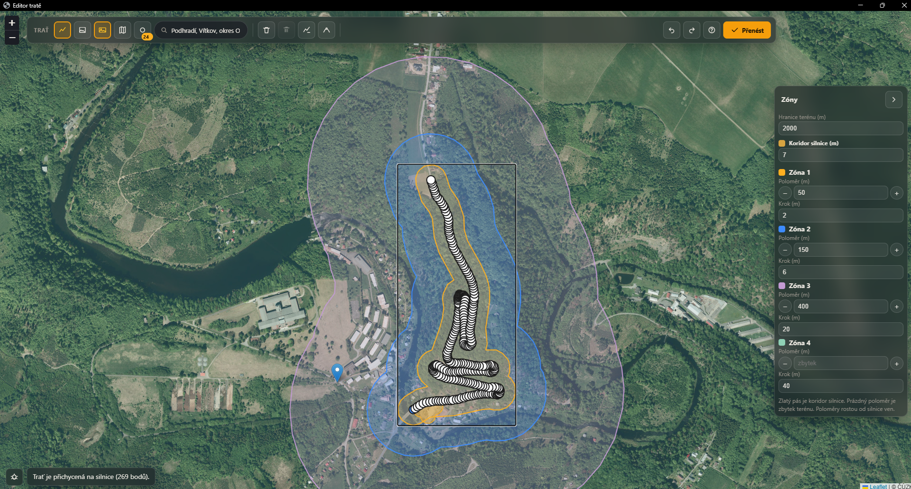
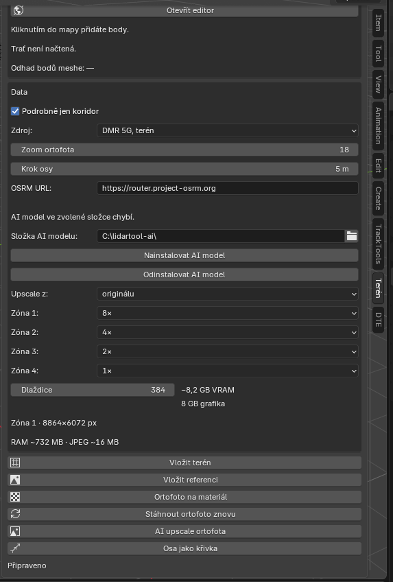

# Traťový terén

Addon pro Blender 4.2 a novější. Z tratě nakreslené v mapě postaví mesh terénu podle výšek ČÚZK a položí na něj ortofoto. Panel je ve 3D okně pod záložkou **Terén**.

Celý projekt byl nakódován AI modelem Grok 4.7. Vydavatelem je DanoCZE a kód addonu je pod licencí MIT. Převzaté knihovny, data a služby mají vlastní podmínky. Přehled je níže, plné texty licencí v [LICENSE.md](LICENSE.md).

## Náhled

Editor tratě nad ortofotem. Oranžové tlačítko **Převést** pošle nakreslenou trať do Blenderu.

Panel **Terén** v postranní liště 3D okna.

## Instalace z release

1. Otevřete [Releases](https://github.com/DanoCZE/blender-lidartool/releases) a stáhněte ZIP přiložený k release. Je to archiv addonu, ne odkaz **Source code (zip)** na konci stránky. Ten má v kořeni jinou složku a Blender z něj addon nenačte.
2. V Blenderu otevřete **Edit > Preferences > Add-ons**, vpravo nahoře rozbalte šipku a zvolte **Install from Disk**.
3. Vyberte stažený ZIP. Nerozbalujte ho.
4. Addon **Traťový terén** zapněte zaškrtnutím.
5. Ve 3D okně otevřete postranní panel (**N**), záložku **Terén**, a jednou spusťte **Připravit prostředí**. Addon si do vlastního Pythonu doinstaluje knihovny z `requirements.txt`.

## Práce

1. **Otevřít editor** a v mapě nakreslit trať. Oranžové tlačítko ji přenese do scény.
2. V editoru jde přepnout na **Budovy**, kliknutím vybrat půdorysy a vložit je do kolekce **Budovy**. Střecha je z DMP OK, pata z DMR 5G. Editor při tom zůstane otevřený.
3. **Vložit terén** stáhne výškový model a vloží mesh.
4. **Ortofoto na materiál** stáhne ortofoto ČÚZK. **Stáhnout ortofoto znovu** ho vymění a mesh ve scéně nechá.
5. **AI upscale ortofota** zvětší texturu modelem Real-ESRGAN. Nejdřív v panelu nainstalujte AI model. Chce grafiku NVIDIA. Složku instalace i odinstalaci nastavíte tamtéž. Upscale jde spustit z originálu, nebo z už zvětšené verze.

Podrobný popis mapového editoru je v `editor/help.md`.

## Zdroje

Data map a model se do archivu addonu nekopírují. Stahují se až při práci a platí licence jejich poskytovatelů.

### ČÚZK

Výšky a ortofoto pocházejí z otevřených dat Českého úřadu zeměměřického a katastrálního: ortofoto České republiky, digitální model reliéfu 5. generace (DMR 5G), digitální model povrchu 1. generace (DMP 1G) a digitální model povrchu z obrazové korelace (DMP OK). Půdorysy budov jsou ze ZABAGED. Jsou pod licencí [Creative Commons BY 4.0](https://creativecommons.org/licenses/by/4.0/deed.cs). Podmínky poskytování jsou na [Geoportálu ČÚZK](https://geoportal.cuzk.gov.cz/Dokumenty/Podminky.pdf).

Služby, které addon volá:

- ortofoto: `https://ags.cuzk.gov.cz/arcgis1/rest/services/ORTOFOTO_WM/MapServer`
- DMR 5G: `https://ags.cuzk.gov.cz/arcgis2/rest/services/dmr5g/ImageServer`
- DMP 1G: `https://ags.cuzk.gov.cz/arcgis2/rest/services/dmp1g/ImageServer`
- DMP OK: `https://ags.cuzk.gov.cz/arcgis2/rest/services/dmp/ImageServer`
- budovy ZABAGED: `https://ags.cuzk.gov.cz/arcgis/rest/services/ZABAGED_POLOHOPIS/MapServer/99`

Kdo zveřejní trať z těchto dat, uvede zdroj a licenci. U textury zvětšené modelem Real-ESRGAN uvede i úpravu. Vhodné znění: „Výšky a ortofoto: © Český úřad zeměměřický a katastrální, licencováno pod CC BY 4.0. Ortofoto bylo zvětšeno modelem Real-ESRGAN (BSD-3-Clause).“

### OpenStreetMap

Podkladová mapa v editoru bere dlaždice z `https://tile.openstreetmap.org`. Data jsou © OpenStreetMap contributors a jsou dostupná pod [Open Database License](https://www.openstreetmap.org/copyright). Použití dlaždic se řídí [Tile Usage Policy](https://operations.osmfoundation.org/policies/tiles/).

Vyhledání adresy posílá dotaz na Nominatim (`https://nominatim.openstreetmap.org`). Platí [Nominatim Usage Policy](https://operations.osmfoundation.org/policies/nominatim/).

Přichycení tratě na silnici volá ukázkové servery OSRM, které provozuje FOSSGIS: `https://routing.openstreetmap.de` a záložní `https://router.project-osrm.org`. Jde o ukázkový provoz, ne o službu pro hromadné použití. Trasa se označí jako výstup OSRM nad daty © OpenStreetMap contributors. Podmínky jsou na [routing.openstreetmap.de](https://routing.openstreetmap.de/about.html).

### Rally-Maps

Na přání uživatele addon stáhne stránku z rally-maps.com a přečte z ní souřadnice tratě. Trať na tom webu patří jeho provozovateli a platí jeho podmínky. Souřadnice se do archivu addonu neukládají.

### Knihovny v editoru

Jsou v `editor/vendor` a znovu se sestaví v `editor` příkazem `npm install`.

- Leaflet 1.9.4, BSD-2-Clause, Copyright (c) 2010–2023 Volodymyr Agafonkin, Copyright (c) 2010–2011 CloudMade. [https://leafletjs.com](https://leafletjs.com)
- Turf.js 6.5.0, MIT, Copyright (c) 2019 Morgan Herlocker. [https://turfjs.org](https://turfjs.org)
- marked 15.0.12, MIT, Copyright (c) 2018+ MarkedJS, Copyright (c) 2011–2018 Christopher Jeffrey. Součástí je i licence formátu Markdown, Copyright © 2004 John Gruber.

V balíku Turf.js je beze změny knihovna MarchingSquares.js 1.2.0, Copyright (c) 2015 Ronny Lorenz. Je pod GNU AGPL-3.0 s dodatečným svolením, že nezměněné vložení samo o sobě nepodřizuje zbytek programu licenci AGPL. Úpravy MarchingSquares.js je třeba zveřejnit.

### Real-ESRGAN a PyTorch

Zvětšení textury používá síť Real-ESRGAN x4plus. Váhy `RealESRGAN_x4plus.pth` se stahují z [Real-ESRGAN](https://github.com/xinntao/Real-ESRGAN/releases/download/v0.1.0/RealESRGAN_x4plus.pth), licence BSD-3-Clause, a v archivu addonu nejsou. Soubor `engine/rrdb.py` je implementace sítě RRDBNet z tohoto projektu.

PyTorch s podporou CUDA a související knihovny NVIDIA se instalují zvlášť do složky zvolené v panelu. Platí jejich vlastní licence a do tohoto repozitáře se nekopírují.

### Knihovny Pythonu

`requirements.txt` uvádí rasterio, pyproj, numpy, shapely, pillow, gpxpy, requests, trimesh, scipy, laspy a truststore. Do archivu se nebalí. Po příkazu **Připravit prostředí** je nainstaluje pip a u každého balíčku zůstane jeho vlastní licence.
